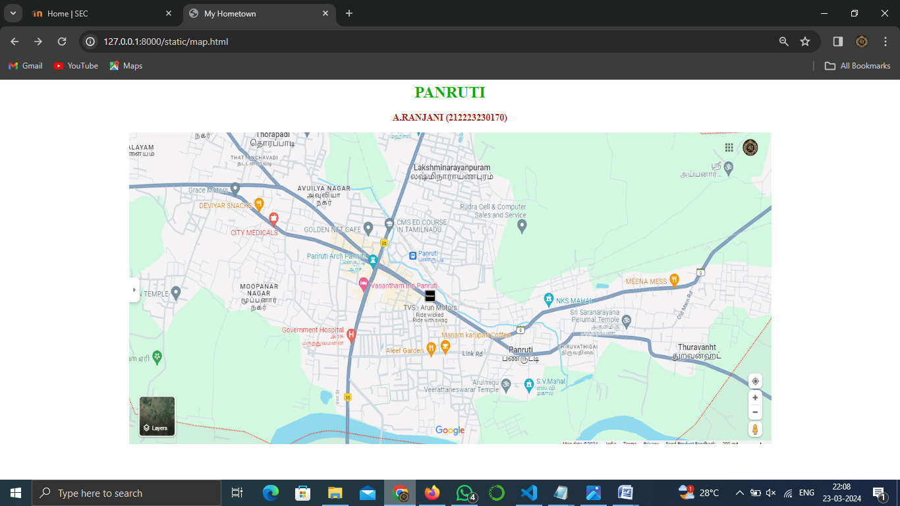
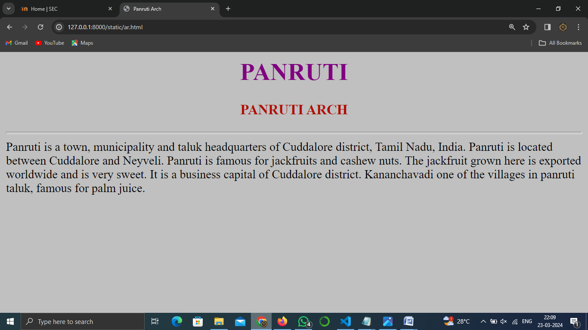
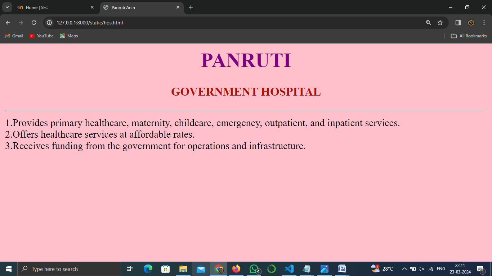
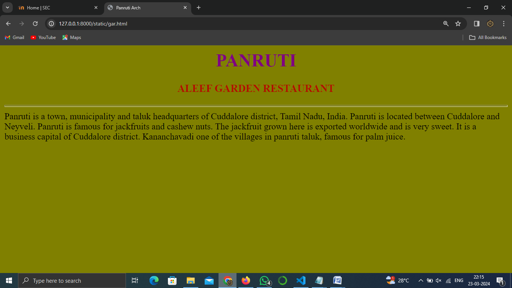
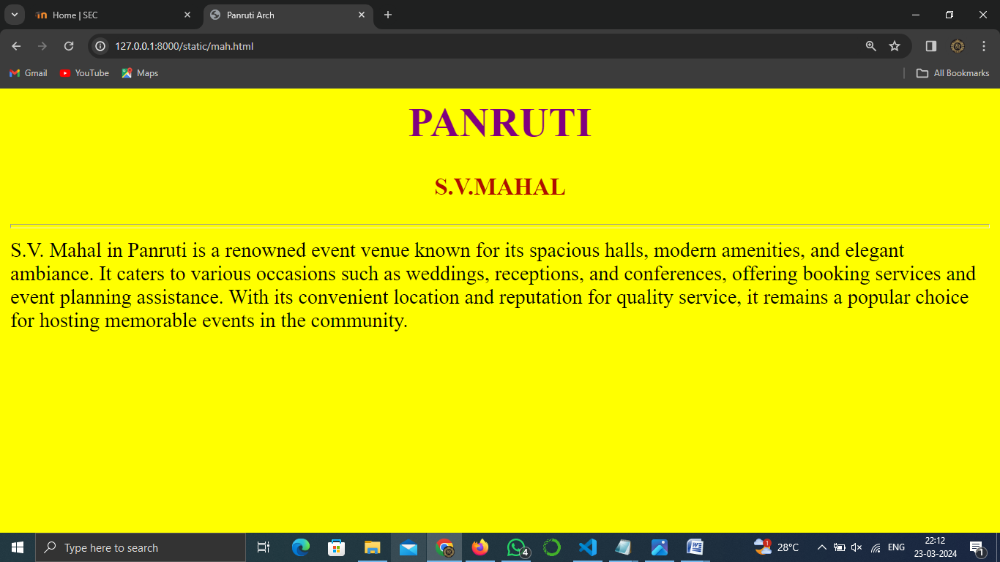
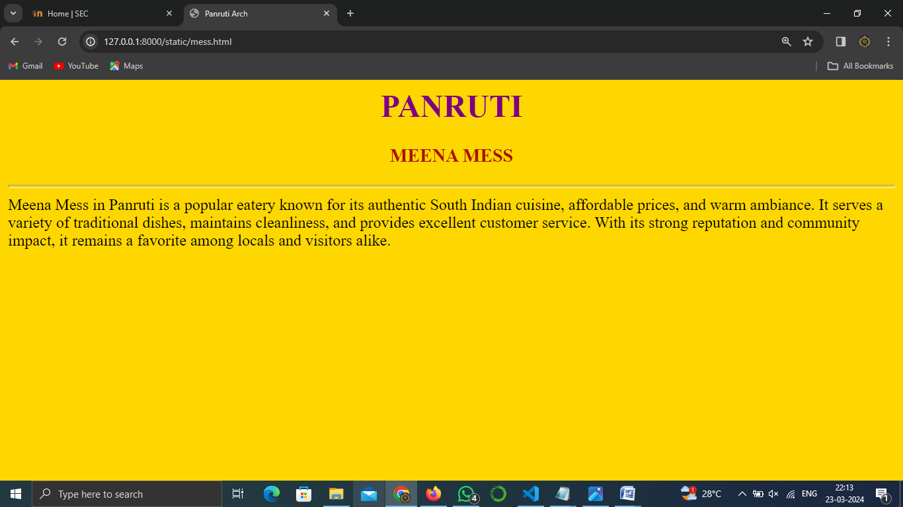

# Ex04 Places Around Me
## Date: 23.03.2024

## AIM
To develop a website to display details about the places around my house.

## DESIGN STEPS

### STEP 1
Create a Django admin interface.

### STEP 2
Download your city map from Google.

### STEP 3
Using ```<map>``` tag name the map.

### STEP 4
Create clickable regions in the image using ```<area>``` tag.

### STEP 5
Write HTML programs for all the regions identified.

### STEP 6
Execute the programs and publish them.

## CODE
```
html>
  <head>
    <title>My Hometown</title>
  </head>
  <body align="center">
        <h1 align="center">
        <font color="ruby"><b>PANRUTI</b></font>
        </h1>
    <h3 align="center">
        <font color=blue"><b>A.RANJANI (212223230170) </b></font>
        </h3>
    

    <map name="#Panruti-map">
    <area target="" alt="panruti arch" title="panruti arch" href="ar.html" coords="524,247,511,209,463,249,488,270,528,284,552,255,553,227,509,209" shape="poly">
    <area target="" alt="government jospital" title="government jospital" href="hos.html" coords="477,394,47" shape="circle">
    <area target="" alt="aleef garden" title="aleef garden" href="gar.html" coords="638,423,34" shape="circle">
    <area target="" alt="s.v.mahal" title="s.v.mahal" href="mah.html" coords="862,485,56" shape="circle">
    <area target="" alt="meena mess" title="meena mess" href="mess.html" coords="1129,319,1198,252" shape="rect">
    </map>
  </body>
</html>


<html>
<head>
    <center>
    <title>Panruti Arch</title>
    </center>
    </head>
    <body bgcolor="silver">
     <h1 align="center">
            <font color="purple"><b>PANRUTI</b></font>
            </h1>
        <h3 align="center">
            <font color=blue"><b>PANRUTI ARCH</b></font>
            </h3>
    <hr size="4" colour="white">
    Panruti is a town, municipality and taluk headquarters of Cuddalore district, Tamil Nadu, India. Panruti is located between Cuddalore and Neyveli. Panruti is famous for jackfruits and cashew nuts. The jackfruit grown here is exported worldwide and is very sweet. It is a business capital of Cuddalore district. Kananchavadi one of the villages in panruti taluk, famous for palm juice.
    </body>
    </head>
</html>


<html>
<head>
    <center>
    <title>Panruti Arch</title>
    </center>
    </head>
    <body bgcolor="pink">
     <h1 align="center">
            <font color="purple"><b>PANRUTI</b></font>
            </h1>
        <h3 align="center">
            <font color=blue"><b>GOVERNMENT HOSPITAL</b></font>
            </h3>
    <hr size="4" colour="white">
    1.Provides primary healthcare, maternity, childcare, emergency, outpatient, and inpatient services.
    <br>
    2.Offers healthcare services at affordable rates.
    <br>
    3.Receives funding from the government for operations and infrastructure.
    </body>
    </head>
</html>

<html>
<head>
    <center>
    <title>Panruti Arch</title>
    </center>
    </head>
    <body bgcolor="olive">
     <h1 align="center">
            <font color="purple"><b>PANRUTI</b></font>
            </h1>
        <h3 align="center">
            <font color=blue"><b>ALEEF GARDEN RESTAURANT</b></font>
            </h3>
    <hr size="4" colour="white">
    Panruti is a town, municipality and taluk headquarters of Cuddalore district, Tamil Nadu, India. Panruti is located between Cuddalore and Neyveli. Panruti is famous for jackfruits and cashew nuts. The jackfruit grown here is exported worldwide and is very sweet. It is a business capital of Cuddalore district. Kananchavadi one of the villages in panruti taluk, famous for palm juice.
    </body>
    </head>
    </html>

    <html>
<head>
    <center>
    <title>Panruti Arch</title>
    </center>
    </head>
    <body bgcolor="yellow">
     <h1 align="center">
            <font color="purple"><b>PANRUTI</b></font>
            </h1>
        <h3 align="center">
            <font color=blue"><b>S.V.MAHAL</b></font>
            </h3>
    <hr size="4" colour="white">
    
    </body>
    </head>
</html>


<html>
<head>
    <center>
    <title>Panruti Arch</title>
    </center>
    </head>
    <body bgcolor="gold">
     <h1 align="center">
            <font color="purple"><b>PANRUTI</b></font>
            </h1>
        <h3 align="center">
            <font color=blue"><b>MEENA MESS</b></font>
            </h3>
    <hr size="4" colour="white">
    Meena Mess in Panruti is a popular eatery known for its authentic South Indian cuisine, affordable prices, and warm ambiance. It serves a variety of traditional dishes, maintains cleanliness, and provides excellent customer service. With its strong reputation and community impact, it remains a favorite among locals and visitors alike.
    </body>
    </head>
</html>
```

## OUTPUT



















## RESULT
The program for implementing image maps using HTML is executed successfully.
